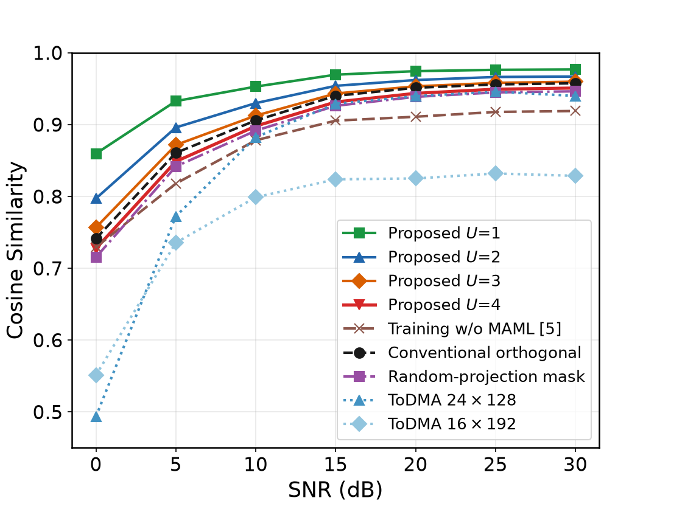
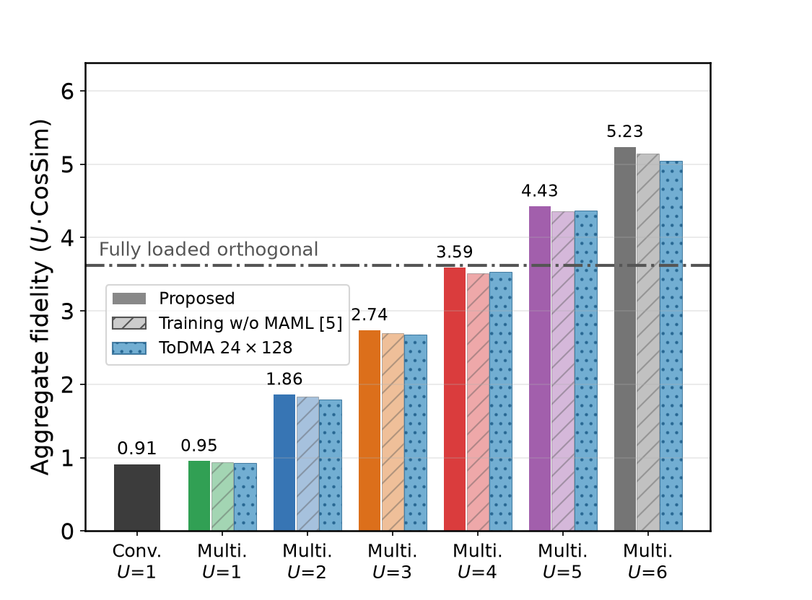
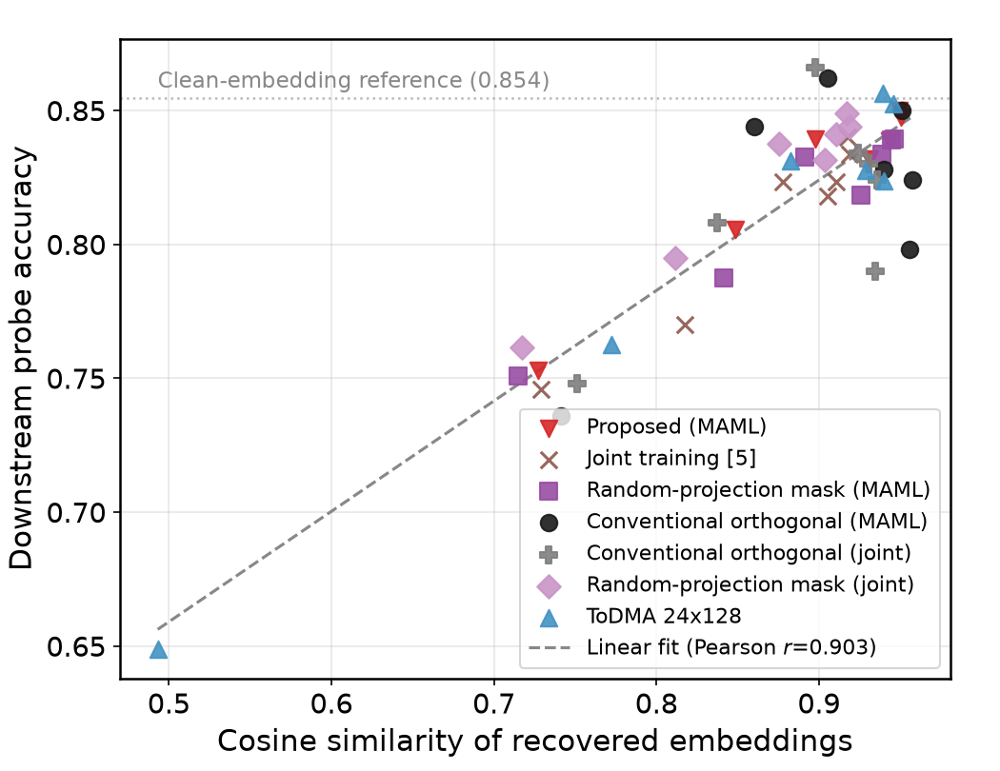

# Semantic Multiplexing Gain in Wireless Systems via Expanded Embeddings: A BERT Case Study

Code, stored results, and supplementary material for the IEEE
Communications Letters submission by Ki-Ho Lee, Hyun-Ho Choi, and
Jung-Ryun Lee.

Multiple users share one expanded embedding block of dimension
`d_s = K * d_b`: each user's frozen BERT sentence embedding is projected
into the shared space, superimposed through learnable masks, and
demultiplexed by user-wise attention. All reported transceivers are
trained with SNR-aware MAML; the joint multi-SNR training of the earlier
JSAC paper is included as a prior-art reference.

## Files

| File | Purpose |
|---|---|
| `bert_semcom.py` | Shared library: BERT extractor, transceiver model, channel, MAML helpers |
| `cl_experiments.py` | Held-out split, joint-trained configurations, ToDMA token-domain benchmark, linear probe, latency |
| `cl_maml_all.py` | SNR-aware MAML training for every reported configuration (including the conventional orthogonal scheme) |
| `cl_maml_extra.py` | MAML K sweep (K = 1, 2, 8) and DistilBERT replication |
| `replot_cl.py` | Regenerates Figs. 2 and 3 of the letter from the stored JSON results |
| `probe_vs_cosine.py` | Supplementary probe-accuracy-versus-cosine-similarity analysis |
| `fig_cl/*.json`, `fig_cl/*.csv` | Stored raw results behind every figure and quoted number |

## Reproducing

Requirements: Python 3.10+, PyTorch (CUDA), `transformers`, `datasets`,
`matplotlib`, `numpy`. AG News loads from the Hugging Face hub
(`fancyzhx/ag_news` fallback included).

```bash
python cl_experiments.py --save-dir fig_cl   # joint runs + ToDMA benchmark (~3 h on a laptop GPU)
python cl_maml_all.py    --save-dir fig_cl   # MAML runs (~9 h)
python cl_maml_extra.py  --save-dir fig_cl   # MAML K sweep + DistilBERT (~6 h)
python replot_cl.py                          # Figs. 2 and 3 from stored results
python probe_vs_cosine.py                    # supplementary analysis below
```

All experiments fix their random seeds (training seed 42, evaluation
seed 123, ToDMA seed 7) and evaluate on a held-out test split of 2,000
AG News sentences disjoint from the 8,000-sentence training pool.
`replot_cl.py` and `probe_vs_cosine.py` read only the stored results,
so every figure is regenerable without rerunning the experiments.

## Figures of the letter

**Fig. 2 - per-user cosine similarity vs. SNR** (proposed scheme for
U = 1..4 at K = 4, the conventional orthogonal scheme, the
matched-budget schemes, and the joint training of the earlier JSAC
paper, all on the held-out test set):



**Fig. 3 - aggregate fidelity across load** (SNR-aware MAML vs. joint
training at 20 dB, with the fully loaded orthogonal reference):



## Supplementary: probe accuracy vs. cosine similarity

The letter measures semantic fidelity by the cosine similarity of the
recovered embeddings and corroborates it with a downstream perception
metric: the AG News topic accuracy of a linear probe trained on clean
training-pool embeddings and applied to the recovered test embeddings
(clean reference about 0.855, sampling error about +/-0.01).

Across 7 schemes x 7 SNRs (49 operating points), probe accuracy tracks
cosine similarity with a Pearson correlation of **r = 0.903**:



Two readings follow. First, the low-SNR advantage of the analog
embedding schemes over the token-domain scheme appears in both metrics
(for example 0.848 vs. 0.772 in CosSim and 0.805 vs. 0.762 in accuracy
at 5 dB). Second, schemes within about 0.01 of each other in CosSim
differ in accuracy only on the order of the sampling error, so the
cosine metric used throughout the letter is consistent with downstream
perception on this task.


